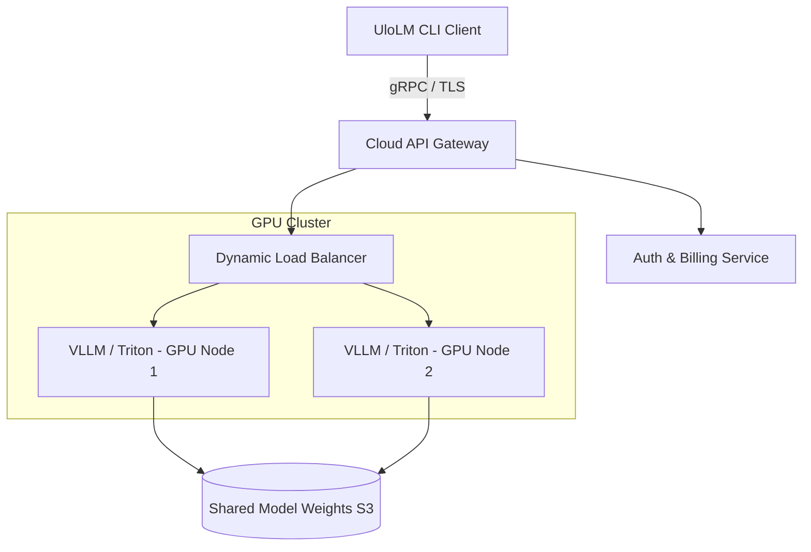

# UloLM CLI, Security, and Deployment Specification

This document details the **CLI Terminal Experience**, **Security Sandbox Architecture**, and **Deployment Strategy** for both local and cloud installations of UloLM.

---

## 1. CLI Architecture & Terminal UX Design

The CLI is designed for speed, clarity, and ease of use. It implements a non-obtrusive, natural conversation model that supports interactive code generation directly within terminal contexts.

### 1.1 Startup Sequence:
When `ulolm` is run, the engine initializes in under 15ms and displays:

```text
UloLM Ready
Current Model: UloLMBase (Local)
Active Workspace: /Users/kavs1/projects/my-app/

You:
```

### 1.2 UX Animation and Feedbacks:
* **Natural Conversational Processing**: No commands are required. The user types naturally.
* **Progress Tracking**: While running multi-step tasks, UloLM displays a dynamic multi-stage progress track showing:
  * `⠋ Routing to Coding Expert...`
  * `⠙ Writing src/main.py...`
  * `⠸ Verifying project builds...`
* **Syntax Highlighting**: Outputs are rendered using an ANSI-compatible Markdown renderer supporting code blocks, bold text, and clickable file hyperlinks.

### 1.3 Cross-Platform Handling
To ensure a consistent terminal experience across Windows, macOS, and Linux:
* **Windows (Command Prompt / PowerShell / Windows Terminal)**: Enforces virtual terminal processing (`ENABLE_VIRTUAL_TERMINAL_PROCESSING`) to enable ANSI escape sequences and colors.
* **macOS & Linux**: Native support for UTF-8 and ANSI sequences. Uses standard ioctls to dynamically determine screen width and height.

---

## 2. Security Sandbox Architecture

AI models are capable of generating shell scripts, writing arbitrary files, or deleting workspace folders. To prevent malware generation or accidental data loss, UloLM uses a **tiered security model**:

```text
       +---------------------------------------------+
       |             Generated Action                |
       +---------------------------------------------+
                              |
                              v
       +---------------------------------------------+
       |            Permission Gatekeeper            | <--- User Approval Prompt
       +---------------------------------------------+
                              |
                 +------------+------------+
                 | (Safe)                  | (Untrusted / Code Run)
                 v                         v
       +--------------------+    +--------------------+
       |  Workspace Writer  |    | Wasm / Jail Sandbox| <--- Isolated execution
       | - Writes to target |    | - Restricted memory|
       |   project directory|    | - No network       |
       +--------------------+    +--------------------+
```

### 2.1 Security Layers:
1. **Local Filesystem Isolation**:
   * File creation and modification commands (`WRITE_FILE`, `APPEND_FILE`) are bound exclusively to the resolved workspace root.
   * Path traversal attempts (e.g., `../../etc/passwd` or `..\..\Windows\System32`) are detected at the runtime layer and blocked immediately.
2. **Execution Permissions**:
   * Command execution (`RUN_COMMAND`) operates with a strict confirmation prompt, listing the exact commands, scripts, and potential risks before the user presses Enter to confirm.
3. **Wasm Sandboxing**:
   * If the model requests to run a test script or compile small scripts to check behavior, UloLM executes it inside a WebAssembly sandbox (using `Wasmtime`) or a lightweight container (Linux namespaces) with virtualized network and filesystem layers.

---

## 3. Deployment & Scaling Strategies

### 3.1 Local Deployment (Download and Run)
To stay beginner-friendly, UloLM is distributed as a single portable binary.
* **Windows**: A portable `ulolm.exe` or a simple MSI installer that registers `ulolm` to the user's `PATH`.
* **macOS**: An application bundle or a shell installer (`curl -fsSL https://ulolm.dev/install.sh | sh`).
* **Linux**: A statically compiled ELF binary or an AppImage.
* **Model Bundling**: On first launch, the runtime auto-detects system specs and offers a single-click download of the recommended model (e.g. `UloLMBase` at 4.5 GB) from the UloLM CDN.

### 3.2 Cloud Scaling & Multi-Tenant Deployment
For teams using the enterprise cloud capability (`UloLMUltra` or remote `UloLMPro` models):



* **GPU Inference Orchestration**: Powered by `vLLM` or `Triton Inference Server` to enable continuous batching and PagedAttention, reducing token latency.
* **Multi-Tenant Isolation**: User project memory remains stored locally on the client machine; only the context-injected prompt headers are transmitted to the cloud over TLS. No cloud-based filesystem modification is executed without local CLI client verification.
