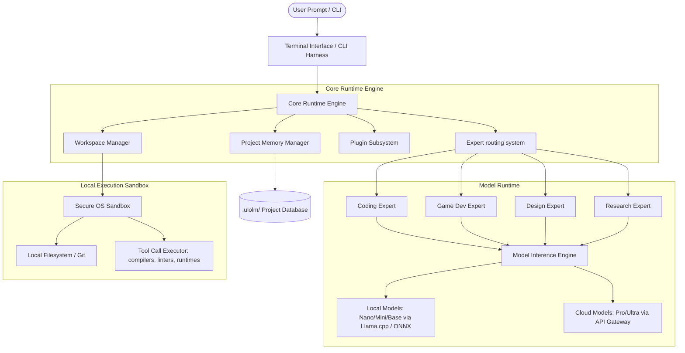

# UloLM System Architecture Specification

This document details the high-level system architecture, folder structure, technology stack, and runtime design of the **UloLM** platform.

---

## 1. High-Level Architecture Overview

UloLM is structured as a layered, modular system to ensure cross-platform consistency, safety, and high-performance execution.



---

## 2. Technology Stack

UloLM uses a hybrid tech stack chosen for performance, startup speed, cross-platform compatibility, and developer adoption.

| Subsystem | Technology Selection | Rationale |
| :--- | :--- | :--- |
| **Core Runtime Engine** | Rust | Uncompromising speed, safety, minimal memory overhead, easy compilation to native binaries for Windows, macOS, and Linux. |
| **CLI / Terminal Harness** | Rust (with `ratatui` / `clap`) | Instant startup (< 10ms), rich interactive Terminal User Interfaces (TUI), native cross-platform terminal control. |
| **Local Inference Engine** | `llama.cpp` (C++) / `ONNX Runtime` | State-of-the-art CPU/GPU inference optimization, SIMD acceleration (AVX-512, NEON), Metal (macOS), CUDA (Windows/Linux), and ROCm support. |
| **Project Memory Manager** | SQLite + `Vector DB` (e.g., USearch / Qdrant-embedded) | SQLite provides lightweight relational storage for file metadata and workspace states. USearch provides single-header vector search with minimal memory footprint. |
| **Execution Sandbox** | Wasmtime (WebAssembly) & Native OS Containerization (e.g., namespaces on Linux, Job Objects on Windows) | Provides secure, isolated running environments for compiler, linting, and execution actions without endangering host filesystems. |

---

## 3. Platform Directory Structure

When UloLM is installed on a host system, it uses the following directory layout:

```text
~/.ulolm/                       # User-level configuration and model cache
├── config.toml                 # Global UloLM preferences (model selection, API keys, paths)
├── cache/
│   ├── models/                 # Cached local model weights (.gguf / .onnx format)
│   │   ├── ulolm-nano-q4.gguf
│   │   └── ulolm-base-q8.gguf
│   └── embeddings/             # Embedding models cache
├── plugins/                    # Third-party plugin binaries and configs
│   ├── godot-integration/
│   └── git-autopush/
├── logs/                       # Diagnostics and debug logs
└── bin/                        # System tools, Wasm runtimes, and helpers
```

In an active project workspace, UloLM initializes a local workspace folder:

```text
/my-project/                    # User's project directory
├── .ulolm/                     # Project-specific memory and context
│   ├── config.json             # Project configuration (override global settings)
│   ├── project_state.json      # Architectural blueprints, target tech stack, project status
│   ├── index.db                # SQLite file mapping local files, hashes, and AST metadata
│   └── vectors/                # Vector store database index for semantic retrieval
├── src/                        # Codebase files
└── ...
```

---

## 4. Runtime Engine Design

The Runtime Engine orchestrates input, memory retrieval, routing, model execution, tool execution, and output presentation.

```text
+-------------------+      1. Read Prompt      +--------------------+
|  Terminal Input   | -----------------------> |    CLI Front-end   |
+-------------------+                          +--------------------+
                                                         | 2. Forward Input
                                                         v
+-------------------+      4. Retrieve State   +--------------------+
|  Project Memory   | <----------------------- |   Runtime Engine   |
+-------------------+                          +--------------------+
          |                                              |
          | 5. Context Injection                         | 3. Query Router
          v                                              v
+-------------------------------------------------------------+
|                     Expert Router Engine                    |
+-------------------------------------------------------------+
          |
          | 6. Route to Selected Expert (e.g., GameDev)
          v
+-------------------------------------------------------------+
|                      Inference Engine                       |
|         - Local Llama.cpp (Nano/Mini/Base)                  |
|         - Cloud API (Pro/Ultra)                             |
+-------------------------------------------------------------+
          |
          | 7. Return Actions & Generated Files
          v
+-------------------------------------------------------------+
|                  Local Execution Environment                |
|         - Sandbox Executor (Wasm / OS Native)               |
|         - Write/Modify Files                                |
+-------------------------------------------------------------+
          |
          | 8. Report Status & Render Outputs
          v
+-------------------+
|  Terminal Output  |
+-------------------+
```

### 4.1 System Components and Lifecycles

1. **Initialization (Startup)**:
   * Load `~/.ulolm/config.toml`.
   * Auto-detect environment: OS, CPU features (AVX2, AVX512), GPU availability (CUDA, Metal, Vulkan), and available development tools (git, python, node, docker).
   * Resolve active workspace: If the terminal is opened inside a directory, locate or initialize `.ulolm/`.

2. **Inference Orchestrator**:
   * Evaluates if the current prompt can be solved locally using the active local model (e.g., `UloLMBase`), or if it requires escalating to `UloLMPro`/`UloLMUltra` in the cloud.
   * If local, sets up the model execution context using shared library bindings (`llama_cpp_sys`).
   * Manages token context window size (sliding window, rope scaling) and state caching (KV caching) to speed up sequential conversations.

3. **Tool Execution Engine (Tool Calling)**:
   * Parses system-level instructions produced by the agent (e.g., `WRITE_FILE`, `RUN_COMMAND`, `GREP`).
   * Feeds requests through a local execution manager that enforces safety constraints (preventing root access, restricting operations to the project directory, etc.).
   * Handles stdout, stderr, and returns command results directly to the model as feedback (closed-loop correction).

4. **Plugin Subsystem**:
   * Standardizes extensions via WebAssembly (Wasm) modules.
   * Plugins hook into system events: `OnPromptReceived`, `BeforeFileWrite`, `OnModelInference`, and `AfterCommandExecution`.
   * This allows external engine integrators (e.g., Godot Engine remote control via WebSockets, Unity asset importers) to run as plugins without recompiling the main binary.
